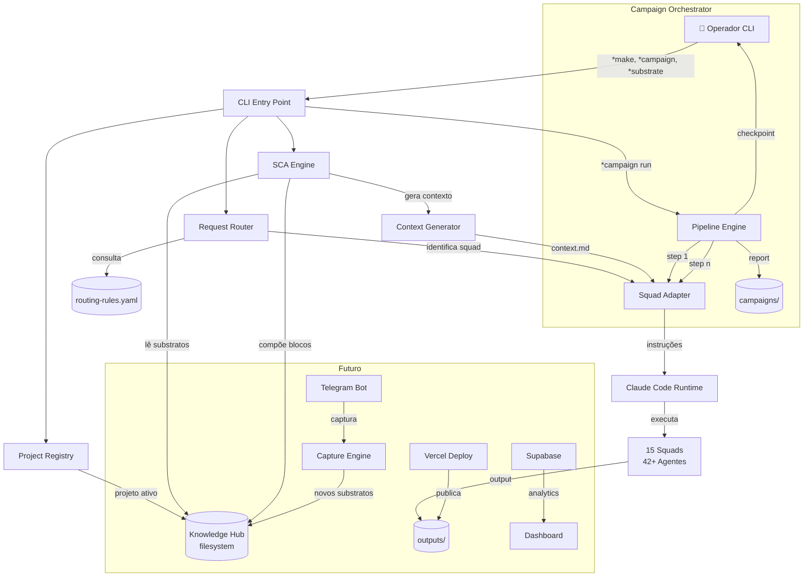
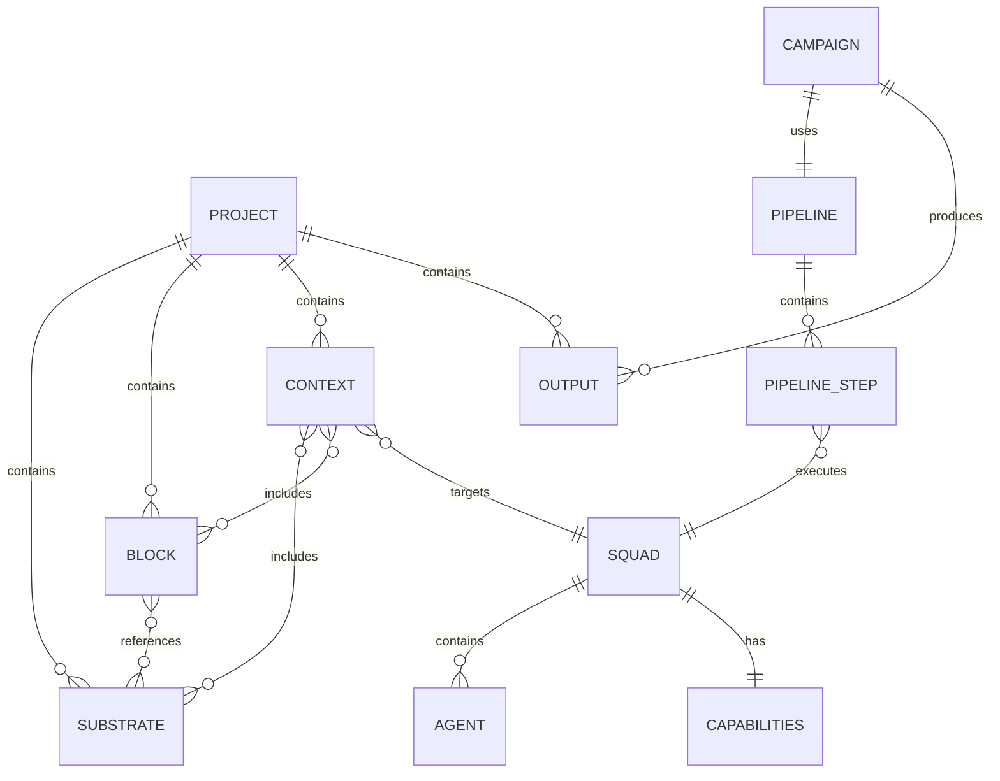
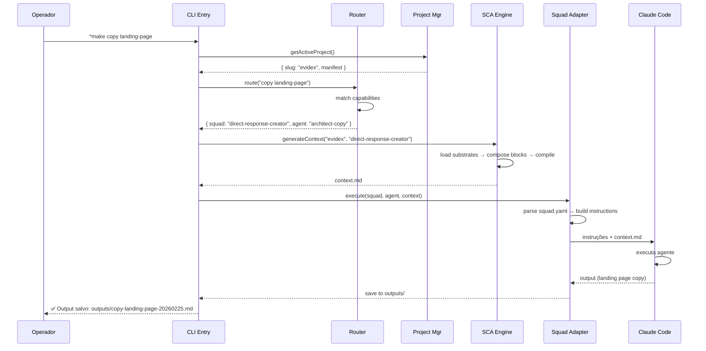
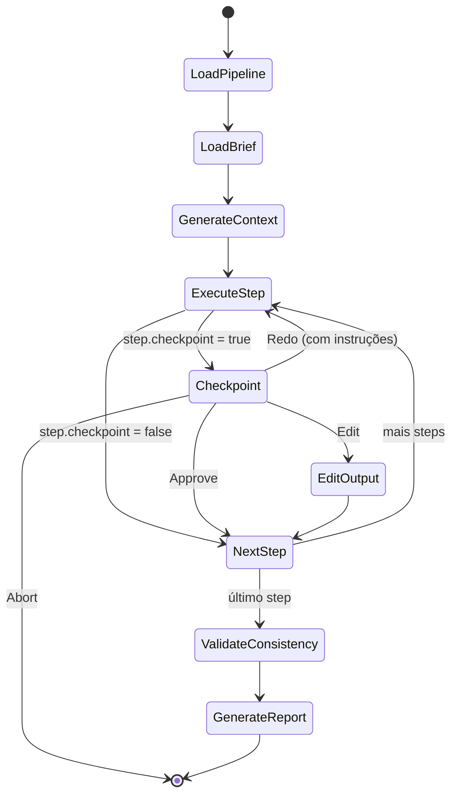
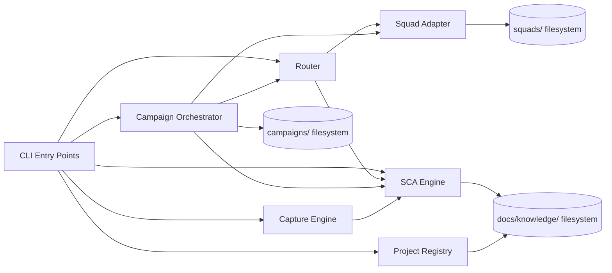
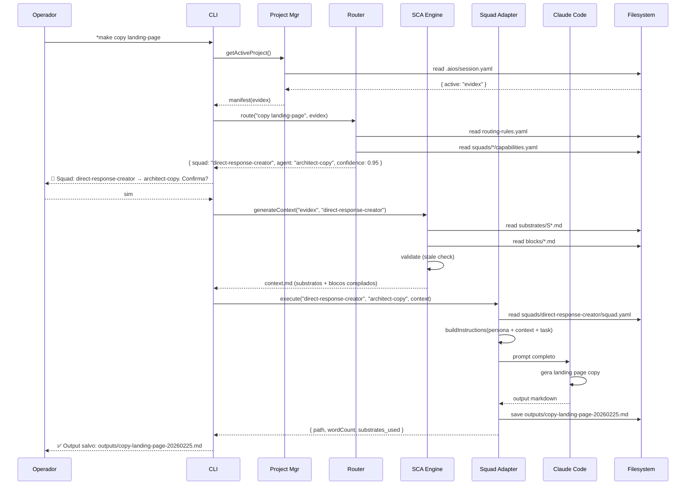
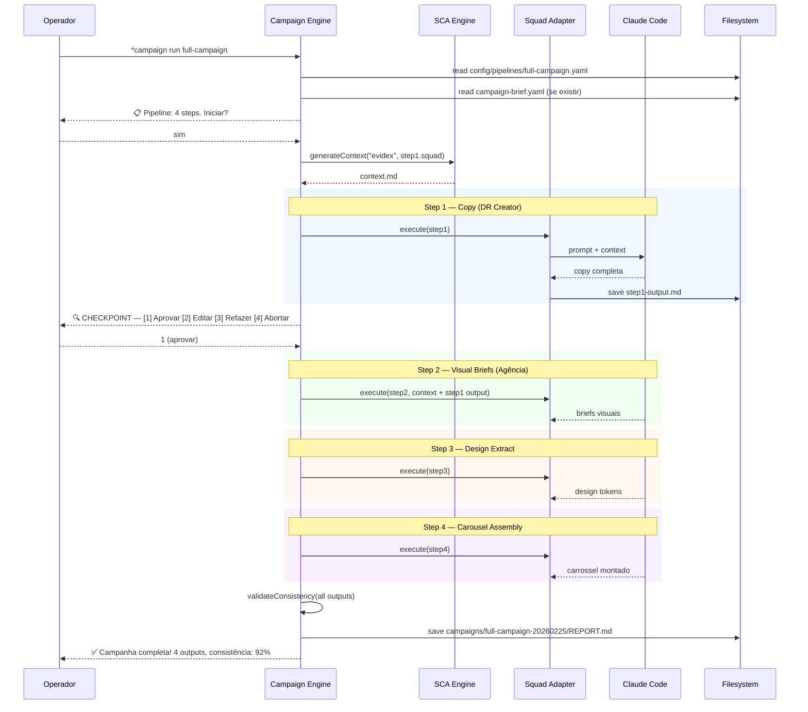
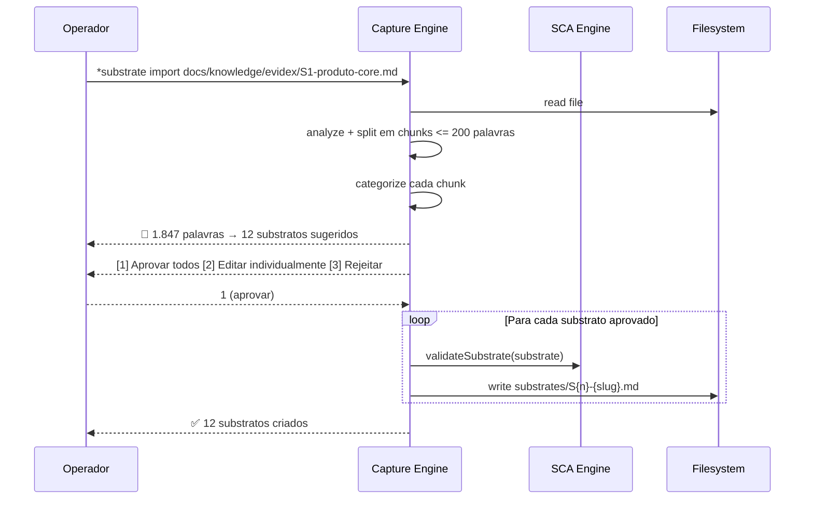
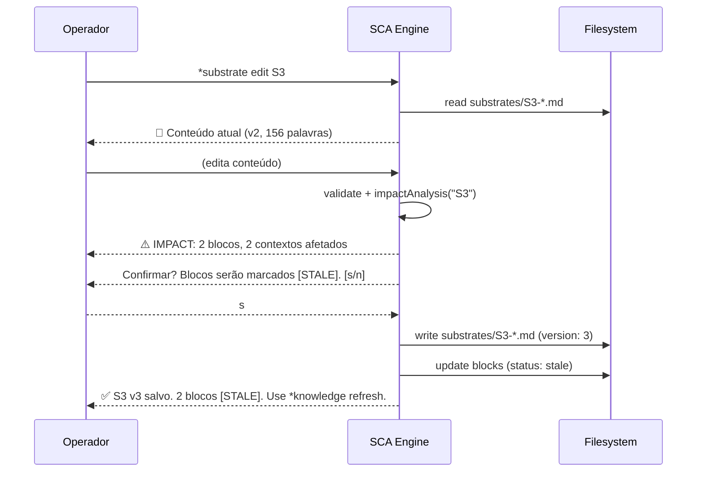

# NEXUS — Fullstack Architecture Document v1.0

> **Sistema Operacional de Empresa com IA**
> **Projeto:** Leonardo Gazola / Innovatech
> **Autor:** Aria (Architect Agent) + Leonardo Gazola
> **Data:** 2026-02-25
> **Status:** Aprovado — pronto para desenvolvimento

---

## Change Log

| Date | Version | Description | Author |
|------|---------|-------------|--------|
| 2026-02-25 | 1.0 | Arquitetura inicial NEXUS | Aria + Leonardo |

---

## 1. Introduction

O NEXUS é um projeto **greenfield** sem starter template. A arquitetura é fundamentalmente diferente de um webapp tradicional:

- **Não há frontend web no MVP** — o sistema é CLI-first via Claude Code
- **Não há servidor/API** — orquestração via agentes de IA no terminal
- **Persistência é filesystem** — markdown/YAML/JSON versionados no git
- **Runtime é Claude Code** — os squads são instruções que o modelo executa

O foco real está em:

1. **SCA Engine** — parser de substratos, compositor de blocos, gerador de contextos
2. **Squad Adapter** — traduzir YAML de squads em instruções executáveis
3. **Campaign Orchestrator** — encadear squads em pipelines com checkpoints
4. **Project Registry** — multi-tenant file-based com namespaces isolados

### Starter Template

N/A — Greenfield project. O projeto estende o framework AIOS existente (`.aios-core/`) como infraestrutura de orquestração.

---

## 2. High Level Architecture

### 2.1 Technical Summary

O NEXUS é um sistema de orquestração de agentes de IA que opera como CLI local, usando o filesystem como banco de dados e o Claude Code como runtime. A arquitetura segue o padrão **Pipeline-Oriented Agent Orchestration**: comandos do usuário são interpretados por um router que seleciona squads, injeta contexto derivado do SCA Engine (substratos → blocos → contextos compilados), e executa agentes em sequência. Toda persistência é markdown/YAML/JSON versionado no git, eliminando dependência de banco de dados externo. O sistema estende o framework AIOS existente (.aios-core/) adicionando 4 módulos core: SCA Engine, Squad Adapter, Campaign Orchestrator e Project Registry.

### 2.2 Platform and Infrastructure

**Plataforma:** Local macOS (Apple Silicon) + Git/GitHub

Não há infraestrutura cloud no MVP. O sistema roda inteiramente no terminal local:

| Serviço | Tecnologia | Papel |
|---------|-----------|-------|
| Runtime | Claude Code (Opus/Sonnet) | Executa agentes e orquestra squads |
| Persistência | Filesystem (git repo) | Substratos, blocos, outputs, configs |
| Versionamento | Git + GitHub | Histórico, colaboração, backup |
| Orquestração | Node.js 22 scripts | SCA Engine, routing, pipelines |
| MCPs (opcional) | Docker MCP Toolkit | EXA, Context7, Apify para pesquisa |
| Captura (futuro) | Telegram Bot | messaging-capture-squad |
| Deploy (futuro) | Vercel | Landing pages geradas |
| Database (futuro) | Supabase | Dados persistentes e analytics |

### 2.3 Repository Structure

**Estrutura:** Monorepo existente (flat, sem monorepo tool)

```
leonardo-gazola/
├── .aios-core/              # L1/L2 — Framework AIOS (protegido)
├── src/                     # ← NEXUS core modules
│   ├── sca-engine/          #   Parser, compositor, gerador de contextos
│   ├── squad-adapter/       #   Traduz squads YAML → instruções executáveis
│   ├── campaign/            #   Orchestrator, pipelines, checkpoints
│   ├── project/             #   Registry, namespace, switching
│   ├── router/              #   Request routing → squad selection
│   ├── capture/             #   Ingestão de docs → substratos
│   └── cli/                 #   Comandos * (entry points)
├── config/                  # Configurações declarativas
│   ├── pipelines/           #   Pipeline definitions (YAML)
│   ├── routing-rules.yaml   #   Regras de roteamento
│   └── squad-context-map.yaml # Mapeamento squad → categorias
├── docs/knowledge/          # Knowledge Hub (por projeto)
│   ├── {project}/
│   │   ├── manifest.yaml    #   Metadados do projeto
│   │   ├── substrates/      #   S1-Sn (atômicos, max 200 palavras)
│   │   ├── blocks/          #   Blocos por etapa de funil
│   │   ├── contexts/        #   Contextos compilados por squad
│   │   └── outputs/         #   Outputs gerados
│   ├── innovatech/
│   ├── evidex/
│   └── ipro/
├── squads/                  # 15 squads (373 arquivos)
├── campaigns/               # Campanhas executadas (outputs agrupados)
├── exports/                 # Templates exportáveis
├── tests/                   # Testes unitários e integração
└── .aios/                   # Runtime state (gitignored)
    ├── session.yaml         #   Projeto ativo, estado atual
    └── routing-log.yaml     #   Histórico de routing
```

### 2.4 High Level Architecture Diagram



### 2.5 Architectural Patterns

- **Pipeline-Oriented Orchestration:** Squads são encadeados em pipelines declarativos (YAML) com inputs/outputs tipados e checkpoints opcionais — _Rationale:_ Permite composição flexível sem código, apenas configuração
- **File-as-Database:** Toda persistência é markdown/YAML/JSON no filesystem versionado pelo git — _Rationale:_ Zero dependências externas, portabilidade total, histórico nativo, diff-friendly
- **Context Injection:** Antes de executar qualquer squad, o SCA Engine compila contexto relevante (substratos + blocos) e injeta como input — _Rationale:_ Squads não precisam saber "onde buscar" — recebem tudo pronto
- **Adapter Pattern (Squad Adapter):** Traduz definições declarativas de squads (YAML) em instruções executáveis para o Claude Code, sem modificar os 373 arquivos existentes — _Rationale:_ Integração não-invasiva com squads legados
- **Namespace Isolation:** Cada projeto tem seu diretório isolado com manifest, substratos, blocos e outputs — trocar de projeto = mudar um ponteiro — _Rationale:_ Multi-tenant sem complexidade de banco de dados
- **Declarative Configuration:** Routing rules, pipelines, squad capabilities e context maps são YAML — nunca hardcoded — _Rationale:_ Operador pode customizar sem programar

---

## 3. Tech Stack

| Category | Technology | Version | Purpose | Rationale |
|----------|-----------|---------|---------|-----------|
| Runtime | Claude Code (Opus/Sonnet) | Latest | Motor de execução dos agentes | Já em uso, orquestra squads nativamente |
| Language | Node.js + JavaScript | 22.x | SCA Engine, CLI, scripts | AIOS é JS-based, já instalado |
| Package Manager | npm | 10.x | Gerenciamento de dependências | Compatibilidade com AIOS existente |
| Data Format | Markdown + YAML + JSON | — | Persistência de substratos, configs, outputs | Portátil, legível, versionável, diff-friendly |
| YAML Parser | js-yaml | 4.x | Parse de configs, pipelines, manifests | Standard, leve, sem dependências |
| Markdown Parser | gray-matter + remark | 4.x / 15.x | Parse de frontmatter + conteúdo de substratos | Ecossistema maduro, suporta frontmatter |
| File Utilities | fs-extra + glob | 11.x / 10.x | Operações de filesystem (copy, move, scan) | API mais ergonômica que fs nativo |
| CLI Framework | Commander.js | 12.x | Entry points dos comandos `*` | Leve, composável, zero boilerplate |
| Validation | Zod | 3.x | Validação de schemas (manifests, substratos, configs) | TypeScript-friendly, composável, mensagens claras |
| Testing | Vitest | 2.x | Unit + integration tests | Rápido, ESM nativo, compatível com Node 22 |
| Versionamento | Git + GitHub | 2.50+ | Histórico, backup, colaboração | Já configurado |
| CI/CD | GitHub Actions | — | Validação automática (lint, tests) | Integrado ao repo |
| Linting | ESLint | 9.x | Qualidade de código | Standard JS ecosystem |
| MCP (opcional) | Docker MCP Toolkit | — | EXA, Context7, Apify para pesquisa web | Já configurado no AIOS |
| Captura (futuro) | Telegram Bot API | — | Ingestão via messaging-capture-squad | Squad já existe |
| Deploy (futuro) | Vercel CLI | — | Publicação de landing pages | Zero-config para sites estáticos |
| Database (futuro) | Supabase | — | Analytics, dados persistentes | Já tem CLI instalado |

### Notas sobre decisões

1. **Sem TypeScript no MVP** — O AIOS existente é JavaScript puro. Migrar agora adiciona fricção sem ganho imediato. Zod cobre validação em runtime. TypeScript pode ser adotado incrementalmente depois.
2. **Sem framework web** — Não há servidor HTTP. Os comandos `*` são entry points que o Claude Code resolve via scripts Node.js.
3. **Vitest sobre Jest** — ESM nativo, mais rápido, melhor DX com Node 22.
4. **Commander.js** — Mesmo que os comandos `*` sejam interceptados pelo AIOS agent system, o Commander serve para scripts standalone e testes fora do Claude Code.

---

## 4. Data Models

As entidades core do NEXUS são todas representadas como arquivos no filesystem. Os "models" são schemas de validação (Zod) que garantem consistência.

### 4.1 Project (manifest.yaml)

**Purpose:** Registro de um projeto/empresa com metadados, configurações e visibilidade.

**Key Attributes:**
- `slug`: string — Identificador único (kebab-case, usado como nome de diretório)
- `name`: string — Nome de exibição
- `description`: string — Descrição curta
- `visibility`: enum — `public | private | personal`
- `market_profile`: string — Perfil de mercado (`pt-br-massa`, `pt-br-premium`, `en-us-direct`)
- `tone`: string — Tom de comunicação padrão
- `created_at`: date — Data de criação

**Schema Zod:**
```javascript
const ProjectManifest = z.object({
  slug: z.string().regex(/^[a-z0-9-]+$/),
  name: z.string().min(1),
  description: z.string().optional(),
  visibility: z.enum(['public', 'private', 'personal']).default('private'),
  market_profile: z.string().default('pt-br-massa'),
  tone: z.string().default('professional'),
  created_at: z.string().datetime(),
  tags: z.array(z.string()).default([]),
  shared_substrates: z.array(z.string()).default([]),
  design_system: z.string().optional(),
})
```

**Relationships:**
- Has many Substrates (1:N via filesystem `substrates/`)
- Has many Blocks (1:N via filesystem `blocks/`)
- Has many Outputs (1:N via filesystem `outputs/`)
- Has many Contexts (1:N via filesystem `contexts/`)

**Arquivo:** `docs/knowledge/{slug}/manifest.yaml`

### 4.2 Substrate (S{n}-{slug}.md)

**Purpose:** Documento atômico primordial — fato puro, denso, estável. Unidade mínima do SCA.

**Schema Zod:**
```javascript
const SubstrateCategory = z.enum([
  'identity',       // quem é a empresa
  'product',        // o que faz o produto
  'pain',           // dores do público
  'solution',       // como resolve
  'objection',      // objeções e contra-argumentos
  'differentiator', // diferenciais competitivos
  'proof',          // provas, cases, métricas
  'offer',          // oferta, preços, condições
  'audience',       // perfil do público, vocabulário
  'context',        // contexto de mercado, nicho
])

const SubstrateFrontmatter = z.object({
  id: z.string().regex(/^S\d+$/),
  title: z.string().min(1),
  category: SubstrateCategory,
  version: z.number().int().positive().default(1),
  status: z.enum(['draft', 'approved', 'deprecated']).default('draft'),
  created_at: z.string().datetime(),
  updated_at: z.string().datetime(),
  source: z.string().optional(),
})
```

**Arquivo:** `docs/knowledge/{project}/substrates/S{n}-{slug}.md`

**Exemplo:**
```markdown
---
id: S1
title: "O que é o Evidex"
category: product
version: 1
status: approved
created_at: 2026-02-25T00:00:00Z
updated_at: 2026-02-25T00:00:00Z
---

O Evidex é uma plataforma que automatiza a comprovação de entregas na cadeia de suprimentos usando IA + WhatsApp. O motorista fotografa o canhoto de entrega, envia pelo WhatsApp, e a IA extrai os dados, valida contra a nota fiscal e registra a prova de entrega em tempo real. Elimina o processo manual de conferência que leva 7-15 dias e custa R$2-5 por canhoto.
```

### 4.3 Block ({stage}-{slug}.md)

**Purpose:** Bloco modular derivado de substratos, organizado por etapa de funil. Peça reutilizável para montar outputs.

**Schema Zod:**
```javascript
const FunnelStage = z.enum([
  'awareness',      // A — Consciência do problema
  'consideration',  // C — Consideração da solução
  'decision',       // D — Decisão de compra
  'loyalty',        // L — Retenção e expansão
])

const BlockFrontmatter = z.object({
  id: z.string().regex(/^[ACDL]\d+$/),
  title: z.string().min(1),
  funnel_stage: FunnelStage,
  substrates: z.array(z.string().regex(/^S\d+$/)).min(1),
  version: z.number().int().positive().default(1),
  status: z.enum(['current', 'stale', 'deprecated']).default('current'),
  compiled_at: z.string().datetime(),
})
```

**Arquivo:** `docs/knowledge/{project}/blocks/{stage}-{slug}.md`

### 4.4 Context ({squad}-context.md)

**Purpose:** Contexto compilado pronto para injetar em um squad.

**Schema Zod:**
```javascript
const ContextFrontmatter = z.object({
  project: z.string(),
  squad: z.string(),
  generated_at: z.string().datetime(),
  substrates_included: z.array(z.string()),
  blocks_included: z.array(z.string()),
  stale_blocks: z.array(z.string()).default([]),
})
```

**Arquivo:** `docs/knowledge/{project}/contexts/{squad}-context.md`

### 4.5 Pipeline (config/pipelines/{name}.yaml)

**Purpose:** Definição declarativa de um encadeamento de squads para campanha.

**Schema Zod:**
```javascript
const PipelineStep = z.object({
  name: z.string(),
  squad: z.string(),
  agent: z.string().optional(),
  input_from: z.enum(['context', 'previous', 'brief']).default('previous'),
  output_to: z.string(),
  checkpoint: z.boolean().default(false),
})

const Pipeline = z.object({
  name: z.string(),
  description: z.string(),
  steps: z.array(PipelineStep).min(1),
  default_project: z.string().optional(),
})
```

### 4.6 Squad Capabilities (squads/{name}/capabilities.yaml)

**Purpose:** Metadados do que um squad produz, precisa e aceita.

**Schema Zod:**
```javascript
const SquadCapabilities = z.object({
  squad: z.string(),
  description: z.string(),
  category: z.enum(['core-commercial', 'support', 'innovatech-specific']),
  produces: z.array(z.string()),
  requires: z.array(z.string()),
  market_profiles: z.array(z.string()),
  pipeline_order: z.array(z.string()).optional(),
  agents: z.array(z.object({
    name: z.string(),
    role: z.string(),
  })),
})
```

### 4.7 Entity Relationship Diagram



---

## 5. CLI Command Interface

> N/A para REST/GraphQL/tRPC — o NEXUS é CLI-first. A "API" é o conjunto de comandos `*`.

### 5.1 Command Map

```yaml
# ── Project Management ──
*project create {slug}          # Cria projeto com manifest.yaml
*project list                   # Lista projetos registrados
*project select {slug}          # Define projeto ativo
*project switch {slug}          # Alias de select
*project status                 # Status do projeto ativo
*project clone {src} {new}      # Duplica estrutura
*project archive {slug}         # Arquiva projeto
*project set-visibility {slug} {level}  # public|private|personal

# ── Substrates (SCA Level 1) ──
*substrate create {id}          # Cria substrato via elicitação
*substrate list                 # Lista substratos do projeto ativo
*substrate view {id}            # Mostra conteúdo + metadados
*substrate edit {id}            # Edita (cria nova versão)
*substrate import {file-path}   # Importa doc → substratos
*substrate impact {id}          # Blocos e contextos afetados

# ── Blocks (SCA Level 2) ──
*block create {id}              # Compõe bloco a partir de substratos
*block list                     # Lista blocos por etapa de funil
*block view {id}                # Conteúdo + referências

# ── Contexts (SCA Compiled) ──
*context generate {project} --for {squad}  # Compila contexto
*context preview                # Dry-run sem salvar

# ── Knowledge Health ──
*knowledge status               # Dashboard do knowledge base
*knowledge health               # Totais, stale, órfãos
*knowledge refresh              # Regenera blocos stale em batch
*knowledge audit                # Relatório de visibilidade

# ── Squad Operations ──
*squads list                    # Registry com capabilities
*squads info {name}             # Detalhes do squad
*make {descrição}               # Request router (natural language)

# ── Campaign Orchestrator ──
*pipeline list                  # Pipelines disponíveis
*pipeline view {name}           # Diagrama ASCII
*pipeline create {name}         # Novo pipeline
*campaign create                # Brief + pipeline → campanha
*campaign run {pipeline}        # Executa pipeline completo
*campaign list                  # Campanhas do projeto
*campaign rerun {id}            # Re-executa com mesmo brief
*campaign validate {id}         # Valida consistência

# ── Outputs ──
*outputs list                   # Histórico de outputs
*outputs view {id}              # Output com rastreabilidade

# ── Capture ──
*capture process                # Processa notas pendentes
*capture status                 # Pendentes e taxa de conversão
*capture import {dir}           # Bulk import

# ── Integrations ──
*integrations list              # Serviços e status
*integrations connect {service} # Setup guiado
*deploy {output-path}           # Vercel deploy

# ── Export ──
*export template {type} {name}  # Empacota como distribuível
*export pipeline --clean        # Pipeline sem refs específicas
*export squad --clean           # Squad sem knowledge
*export method                  # Pacote completo NEXUS

# ── Dashboard ──
*dashboard                      # Resumo geral
*dashboard {project}            # Detalhes do projeto
*dashboard weekly               # Relatório semanal
```

### 5.2 Command Resolution Flow



### 5.3 Dual Execution Model

| Modo | Como funciona | Quando |
|------|--------------|--------|
| **Agent Mode** | Claude Code intercepta `*comando`, carrega contexto do agente, executa com IA | Operação normal — elicitação, routing inteligente, geração de conteúdo |
| **Script Mode** | `node src/cli/index.js comando` executa diretamente | Testes, automação, CI/CD, validação sem IA |

---

## 6. Components

### 6.1 SCA Engine

**Responsibility:** Motor central do Sales Content Architecture — parseia substratos, compõe blocos, gera contextos compilados, executa impact analysis e valida saúde do knowledge base.

**Key Interfaces:**
- `parseSubstrate(filePath)` → `{ frontmatter, content, wordCount }`
- `composeBlock(blockDef, project)` → `{ compiledContent, substrates[], staleness }`
- `generateContext(project, squad)` → `context.md` compilado
- `impactAnalysis(substrateId, project)` → `{ blocks[], contexts[], outputs[] }`
- `healthCheck(project)` → `{ totals, stale[], orphans[], unused[] }`

**Dependencies:** gray-matter, Zod, fs-extra, glob

**Estrutura interna:**
```
src/sca-engine/
├── parser.js          # Parse markdown + frontmatter de substratos/blocos
├── validator.js       # Validação Zod (schema, word count, refs)
├── composer.js        # Combina substratos → bloco compilado
├── context-generator.js  # Agrega blocos → contexto para squad
├── impact.js          # Análise de impacto (substrato → blocos → contextos)
├── health.js          # Health check do knowledge base
├── writer.js          # Serializa e escreve arquivos com frontmatter
└── index.js           # API pública do módulo
```

### 6.2 Squad Adapter

**Responsibility:** Lê definições declarativas de squads (YAML/MD existentes) e traduz em instruções executáveis para o Claude Code, sem modificar os 373 arquivos originais.

**Key Interfaces:**
- `loadSquad(squadName)` → `{ config, agents[], pipelineOrder, capabilities }`
- `resolveAgent(squad, agentName)` → `{ instructions, tools, persona }`
- `buildExecution(squad, agent, context)` → `{ prompt, files[], mode }`
- `listSquads()` → `SquadCapabilities[]`

**Dependencies:** js-yaml, glob, fs-extra

**Estrutura interna:**
```
src/squad-adapter/
├── loader.js          # Lê squad.yaml / squad.md e extrai config
├── capability-reader.js  # Lê/gera capabilities.yaml
├── agent-resolver.js  # Resolve agente específico dentro do squad
├── instruction-builder.js  # Monta prompt final (persona + context + task)
├── registry.js        # Registry centralizado de todos os squads
└── index.js
```

**Design Decision — Adapter não-invasivo:**

O adapter **lê** os arquivos dos squads mas **nunca os modifica**. A camada de adaptação é unidirecional:

```
squads/{name}/squad.yaml     ← Adapter lê
squads/{name}/agents/*.md    ← Adapter lê
squads/{name}/capabilities.yaml  ← Adapter lê (ou gera se ausente)
                                    ↓
                         instruction-builder monta prompt
                                    ↓
                         Claude Code executa
```

### 6.3 Campaign Orchestrator

**Responsibility:** Encadeia múltiplos squads em pipelines sequenciais com checkpoints, context passing entre steps, e relatório final.

**Key Interfaces:**
- `loadPipeline(name)` → `Pipeline` validado
- `runCampaign(pipeline, brief, project)` → `CampaignResult`
- `checkpoint(stepOutput)` → `approve | edit | redo | abort`
- `validateConsistency(campaignOutputs)` → `ConsistencyReport`

**Dependencies:** SCA Engine (context), Squad Adapter (execution), Zod

**Estrutura interna:**
```
src/campaign/
├── pipeline-loader.js    # Parse e valida pipeline YAML
├── engine.js             # Executa steps em sequência
├── checkpoint.js         # Pausa, preview, opções ao operador
├── context-passer.js     # Passa output do step N como input do step N+1
├── consistency.js        # Valida tom, oferta, CTA entre outputs
├── reporter.js           # Gera REPORT.md final
└── index.js
```

**Fluxo de execução:**



### 6.4 Project Registry

**Responsibility:** CRUD de projetos, switching de contexto, namespace isolation, visibilidade e clonagem.

**Key Interfaces:**
- `createProject(slug, metadata)` → cria diretório + manifest
- `listProjects()` → `ProjectManifest[]`
- `selectProject(slug)` → persiste em `.aios/session.yaml`
- `getActiveProject()` → `ProjectManifest`
- `cloneProject(source, target)` → duplica estrutura
- `archiveProject(slug)` → move para `_archived/`

**Estrutura interna:**
```
src/project/
├── registry.js        # CRUD de projetos, listagem, busca
├── session.js         # Projeto ativo (lê/escreve .aios/session.yaml)
├── cloner.js          # Clona estrutura de projeto
├── visibility.js      # Controle de visibilidade e acesso
└── index.js
```

### 6.5 Request Router

**Responsibility:** Recebe pedido em linguagem natural, identifica tipo de output, seleciona squad/agente correto, e delega execução.

**Key Interfaces:**
- `route(request, project)` → `{ squad, agent, outputType, confidence }`
- `matchCapabilities(request)` → `SquadMatch[]` rankeados
- `logRouting(request, result)` → persiste em `.aios/routing-log.yaml`

**Routing Strategy (2 camadas):**

```
Camada 1 — Rule-based (rápido, determinístico):
  routing-rules.yaml define mapeamentos explícitos

Camada 2 — Capability matching (fallback inteligente):
  Se nenhuma rule match, compara request com capabilities.produces[]
  Rankeia por relevância, apresenta opções se ambíguo
```

### 6.6 Capture Engine

**Responsibility:** Ingestão de documentos existentes, notas e capturas, transformando-os em substratos categorizados.

**Key Interfaces:**
- `importFile(filePath, project)` → `SubstrateSuggestion[]`
- `processCaptures(project)` → notas pendentes com sugestões
- `bulkImport(dirPath, project)` → batch processing

### 6.7 Component Dependency Diagram



---

## 7. External APIs

No MVP, o NEXUS opera 100% local sem dependências externas obrigatórias.

### 7.1 Claude Code Runtime (Core)

Motor de execução dos agentes — não é chamado via HTTP, é o próprio runtime.

### 7.2 Docker MCP Toolkit (Opcional — Pesquisa)

| MCP | Access | Purpose |
|-----|--------|---------|
| EXA | `mcp__docker-gateway__web_search_exa` | Pesquisa web |
| Context7 | `mcp__docker-gateway__resolve-library-id` | Docs de bibliotecas |
| Apify | `mcp__docker-gateway__call-actor` | Web scraping |

### 7.3 GitHub API (via gh CLI)

`gh` CLI v2.87.3 — autenticado como `innovatechais`. Push/PR exclusivo @devops.

### 7.4 Integrações Futuras

| Serviço | Purpose | Quando |
|---------|---------|--------|
| Telegram Bot API | Captura 24/7 via messaging-capture-squad | Pós-MVP |
| Vercel CLI | Publicação de landing pages | Pós-MVP |
| Supabase | Analytics + busca semântica | Pós-MVP |

### Dependency Matrix

| Integração | MVP? | Fallback sem ela |
|-----------|------|------------------|
| Claude Code | **SIM** | Nenhum — é o runtime |
| Git/GitHub | **SIM** | Funciona offline, sem backup |
| EXA | Não | Sem pesquisa web automática |
| Apify | Não | Sem scraping automático |
| Telegram | Não | Captura manual |
| Vercel | Não | Deploy manual |
| Supabase | Não | Filesystem para tudo |

---

## 8. Core Workflows

### 8.1 Single Output Flow (`*make`)



### 8.2 Campaign Flow (`*campaign run`)



### 8.3 Substrate Import Flow (`*substrate import`)



### 8.4 Impact Analysis Flow (`*substrate edit`)



---

## 9. Filesystem Schema

> Substitui "Database Schema" — o NEXUS usa filesystem como banco de dados.

### 9.1 Naming Conventions

| Entidade | Pattern | Exemplo |
|----------|---------|---------|
| Project slug | `[a-z0-9-]+` | `evidex`, `clube-tartar` |
| Substrate file | `S{n}-{slug}.md` | `S1-o-que-e-evidex.md` |
| Block file | `{stage}{n}-{slug}.md` | `A1-problema-canhoto.md` |
| Context file | `{squad}-context.md` | `dr-creator-context.md` |
| Output file | `{type}-{slug}-{YYYYMMDD}.md` | `copy-landing-page-20260225.md` |
| Campaign dir | `{pipeline}-{YYYYMMDD-HHmm}/` | `full-campaign-20260225-1430/` |
| Pipeline file | `{name}.yaml` | `full-campaign.yaml` |

### 9.2 Frontmatter Schemas

**Substrate:**
```yaml
---
id: S1                          # UNIQUE por projeto
title: "O que é o Evidex"       # NOT NULL
category: product               # ENUM
version: 1                      # AUTO INCREMENT
status: approved                # ENUM: draft|approved|deprecated
created_at: 2026-02-25T00:00:00Z
updated_at: 2026-02-25T00:00:00Z
source: null                    # NULLABLE
---
{conteúdo markdown — max 200 palavras}
```

**Block:**
```yaml
---
id: A1                          # UNIQUE por projeto
title: "Problema do Canhoto"    # NOT NULL
funnel_stage: awareness         # ENUM
substrates: [S1, S2, S5]       # FK → substrates, NOT EMPTY
version: 1
status: current                 # ENUM: current|stale|deprecated
compiled_at: 2026-02-25T00:00:00Z
---
{conteúdo compilado}
```

**Output:**
```yaml
---
id: out-001                     # UNIQUE global
type: copy                      # ENUM: copy|visual|carousel|brief|design-system|script
format: landing-page            # Subtipo
project: evidex                 # FK → project
squad: direct-response-creator  # Squad que gerou
agent: architect-copy           # Agente
campaign: null                  # NULLABLE → campaign dir
generated_at: 2026-02-25T14:30:00Z
substrates_used: [S1, S2, S3]  # Rastreabilidade
blocks_used: [A1, C1]          # Rastreabilidade
---
{conteúdo do output}
```

**Pipeline:**
```yaml
name: full-campaign
description: "Campanha completa: copy → briefs → design → carrossel"
steps:
  - name: copy-base
    squad: direct-response-creator
    agent: null
    input_from: context
    output_to: step-1-copy.md
    checkpoint: true
  - name: visual-briefs
    squad: agencia-squad
    agent: lens
    input_from: previous
    output_to: step-2-briefs.md
    checkpoint: false
  - name: design-extract
    squad: design-extractor-squad
    input_from: previous
    output_to: step-3-design.md
    checkpoint: false
  - name: carousel-assembly
    squad: agencia-squad
    agent: carousel-architect
    input_from: previous
    output_to: step-4-carousel.md
    checkpoint: true
```

### 9.3 Indexing & Queries

| Query equivalente | Implementação filesystem |
|-------------------|--------------------------|
| `SELECT * FROM substrates WHERE project = 'evidex'` | `glob('docs/knowledge/evidex/substrates/S*.md')` |
| `SELECT * FROM blocks WHERE status = 'stale'` | `glob + parse frontmatter + filter` |
| `JOIN block → substrate` | Parse `substrates[]` do frontmatter |
| `WHERE content LIKE '%canhoto%'` | `grep` no conteúdo |

### 9.4 Integrity Rules

| Regra | Implementação |
|-------|---------------|
| Substrate ID único por projeto | Validação em `validator.js` |
| Block referencia substratos existentes | Check file exists em `composer.js` |
| Max 200 palavras em substrato | Validação em `validator.js` |
| Slug kebab-case | Zod regex |
| Frontmatter válido | Zod parse em toda operação |

---

## 10. CLI Output Architecture

> Substitui "Frontend Architecture" — o "frontend" é o terminal.

### 10.1 Theme

```javascript
export const theme = {
  success: '✅', warning: '⚠️', error: '❌', info: 'ℹ️', stale: '🔄',
  project: '📁', substrate: '🧬', block: '🧱', context: '📋',
  output: '📄', squad: '👥', campaign: '🚀', pipeline: '⛓️',
  step_done: '●', step_active: '◉', step_pending: '○',
  awareness: '🔵', consideration: '🟡', decision: '🟢', loyalty: '🟣',
}
```

### 10.2 Output Patterns

**Lista/Tabela:**
```
🧬 Substratos — evidex (12 total)

 ID   │ Título                    │ Categoria     │ Palavras │ Status
──────┼───────────────────────────┼───────────────┼──────────┼─────────
 S1   │ O que é o Evidex          │ product       │ 142      │ approved
 S2   │ Dor do canhoto manual     │ pain          │ 187      │ approved
```

**Progresso de pipeline:**
```
🚀 Campanha: full-campaign — evidex

   ● Step 1/4 — Copy Base ✅
   ◉ Step 2/4 — Visual Briefs ⏳
   ○ Step 3/4 — Design Extract
   ○ Step 4/4 — Carousel Assembly

   ━━━━━━━━━━━━━━━━━━━━ 50% ━━━━━━━━━━━━━━━━━━━━
```

**Checkpoint:**
```
🔍 CHECKPOINT — Step 1 concluído

   📄 Preview (10 linhas):
   ┌─────────────────────────────────────────┐
   │ # Landing Page — Evidex Pro             │
   │ ## Headline                             │
   │ Seus motoristas já entregaram...        │
   └─────────────────────────────────────────┘

   [1] ✅ Aprovar  [2] ✏️ Editar  [3] 🔄 Refazer  [4] ❌ Abortar
```

**Impact Analysis:**
```
⚠️ IMPACT — Edição de S3

   Blocos afetados:
   ├── 🧱 C1-SolucaoEvidex
   └── 🧱 D1-OfertaPrecos

   Contextos afetados:
   ├── 📋 dr-creator-context
   └── 📋 agencia-context

   Confirmar? [s/n]
```

### 10.3 Generated Output Formats

| Output Type | Formato | Consumidor |
|-------------|---------|-----------|
| Copy (landing page) | Markdown | Dev → HTML ou Vercel |
| Copy (email) | Markdown + frontmatter | Email tool |
| Visual brief | Markdown + specs | Midjourney/DALL-E |
| Carousel | Markdown + slides numerados | Design tool |
| Design system | JSON (W3C DTCG) + CSS | Frontend dev |
| Pitch deck | Markdown + slides | Google Slides/Canva |

---

## 11. Core Module Architecture

> Substitui "Backend Architecture" — os "services" são módulos Node.js.

### 11.1 Module Organization

```
src/
├── index.js                    # API pública
├── sca-engine/                 # 7 arquivos
├── squad-adapter/              # 6 arquivos
├── campaign/                   # 7 arquivos
├── project/                    # 5 arquivos
├── router/                     # 5 arquivos
├── capture/                    # 5 arquivos
├── cli/                        # 15+ arquivos
└── shared/                     # 5 arquivos
    ├── schemas.js              # Schemas Zod centralizados
    ├── fs-utils.js             # readWithFrontmatter, writeWithFrontmatter
    ├── paths.js                # Path resolver centralizado
    ├── constants.js            # Enums, defaults, limites
    └── errors.js               # Error types padronizados
```

### 11.2 Module Pattern

```javascript
// Padrão: ESM, funções puras, Zod via shared, fs via fs-utils
import yaml from 'js-yaml'
import { readWithFrontmatter } from '../shared/fs-utils.js'
import { paths } from '../shared/paths.js'
import { ValidationError } from '../shared/errors.js'

const MAX_WORD_COUNT = 200

export function publicFunction(param) { /* ... */ }
function internalHelper() { /* ... */ }
```

### 11.3 Key Implementation: Context Generator

```javascript
export async function generateContext(project, squad) {
  // 1. Load squad-context-map
  const squadNeeds = loadSquadNeeds(squad)

  // 2. Load matching substrates by category
  const substrates = await loadSubstratesByCategory(project, squadNeeds.categories)

  // 3. Load matching blocks by funnel stage
  const blocks = await loadBlocksByStage(project, squadNeeds.funnel_stages)

  // 4. Check for stale blocks
  const staleBlocks = blocks.filter(b => b.frontmatter.status === 'stale')

  // 5. Load project manifest
  const manifest = loadManifest(project)

  // 6. Compile context document
  return compileContextDocument({ manifest, substrates, blocks, squad, staleBlocks })
}
```

### 11.4 Key Implementation: Instruction Builder

```javascript
export function buildInstruction(squad, agent, context, task) {
  const sections = []
  if (agent.persona) sections.push(`## Persona\n${agent.persona}`)
  sections.push(`## Context (Knowledge Base)\n${context.content}`)
  sections.push(`## Task\n${task.description}`)
  if (agent.output_format) sections.push(`## Output Format\n${agent.output_format}`)
  sections.push(`## Constraints\n- Market: ${context.meta.project?.market_profile}\n- Tone: ${context.meta.project?.tone}\n- Language: pt-br`)
  return sections.join('\n\n---\n\n')
}
```

### 11.5 Configuration Files

**squad-context-map.yaml:**
```yaml
direct-response-creator:
  categories: [product, pain, solution, objection, differentiator, proof, offer, audience]
  funnel_stages: [awareness, consideration, decision]

agencia-squad:
  categories: [product, audience, differentiator, proof]
  funnel_stages: [awareness, consideration]

design-extractor-squad:
  categories: [identity, product]
  funnel_stages: []

vendas-canhotos-squad:
  categories: [product, pain, solution, objection, offer, proof]
  funnel_stages: [consideration, decision]

pitch-investimento-squad:
  categories: [identity, product, differentiator, proof, context]
  funnel_stages: [awareness, consideration, decision]
```

**routing-rules.yaml:**
```yaml
rules:
  - match: [landing-page, lp, página de vendas]
    squad: direct-response-creator
    output_type: copy
  - match: [headline, headlines, títulos]
    squad: direct-response-creator
    agent: headline-sniper
    output_type: copy
  - match: [email, email sequence, sequência]
    squad: direct-response-creator
    agent: email-architect
    output_type: copy
  - match: [carousel, carrossel, carrosséis]
    squad: agencia-squad
    agent: carousel-architect
    output_type: carousel
  - match: [visual, imagem, brief visual, midjourney]
    squad: agencia-squad
    agent: lens
    output_type: visual
  - match: [design system, design tokens, extrair design]
    squad: design-extractor-squad
    output_type: design-system
  - match: [pitch, investidor, investimento, deck]
    squad: pitch-investimento-squad
    output_type: copy
  - match: [ads, anúncio, tráfego]
    squad: clickbank-ads-squad
    output_type: copy
fallback: capability-match
```

---

## 12. Unified Project Structure

```
leonardo-gazola/
├── .aios-core/                         # L1/L2 — Framework AIOS (PROTEGIDO)
├── src/                                # NEXUS Core Modules (~45 arquivos)
│   ├── index.js
│   ├── sca-engine/                     # Parse, compose, context, impact, health
│   ├── squad-adapter/                  # Load, resolve, build instructions
│   ├── campaign/                       # Pipeline, engine, checkpoint, consistency
│   ├── project/                        # Registry, session, clone, visibility
│   ├── router/                         # Match, rules, disambiguate, log
│   ├── capture/                        # Import, split, categorize, process
│   ├── cli/                            # Commands + formatters
│   └── shared/                         # Schemas, fs-utils, paths, errors
├── config/                             # Configurações declarativas
│   ├── pipelines/                      # full-campaign, landing-page, social-media
│   ├── routing-rules.yaml
│   └── squad-context-map.yaml
├── docs/                               # Documentação
│   ├── knowledge/                      # Knowledge Hub (por projeto)
│   │   ├── innovatech/                 # Empresa
│   │   ├── evidex/                     # Produto principal
│   │   ├── ipro/                       # Produto secundário
│   │   └── _archived/
│   ├── prd/nexus-prd-v1.md
│   ├── architecture/nexus-architecture-v1.md
│   └── frameworks/
├── squads/                             # 15 Squads, 373 arquivos (READ ONLY)
├── campaigns/                          # Campanhas executadas
├── exports/                            # Templates exportáveis
├── tests/                              # ~25 arquivos de teste
│   ├── sca-engine/
│   ├── squad-adapter/
│   ├── campaign/
│   ├── project/
│   ├── router/
│   ├── capture/
│   ├── shared/
│   ├── fixtures/
│   └── helpers/
├── .aios/                              # Runtime state (GITIGNORED)
├── .github/workflows/ci.yaml
├── package.json
├── vitest.config.js
├── eslint.config.js
└── .env.example
```

**Total novo a criar: ~75 arquivos** (src/ + config/ + tests/)

---

## 13. Development Workflow

### 13.1 Commands

```bash
npm test                    # Vitest run
npm run test:watch          # Watch mode
npm run test:coverage       # Coverage report
npm run lint                # ESLint check
npm run lint:fix            # Auto-fix
npm run validate            # lint + test
node src/cli/index.js {cmd} # Script mode (sem Claude Code)
```

### 13.2 package.json

```json
{
  "name": "leonardo-gazola",
  "version": "0.1.0",
  "private": true,
  "type": "module",
  "bin": { "nexus": "src/cli/index.js" },
  "scripts": {
    "test": "vitest run",
    "test:watch": "vitest",
    "test:coverage": "vitest run --coverage",
    "lint": "eslint src/ tests/",
    "lint:fix": "eslint src/ tests/ --fix",
    "validate": "npm run lint && npm run test"
  },
  "dependencies": {
    "commander": "^12.0.0",
    "fs-extra": "^11.0.0",
    "glob": "^10.0.0",
    "gray-matter": "^4.0.0",
    "js-yaml": "^4.0.0",
    "zod": "^3.0.0"
  },
  "devDependencies": {
    "eslint": "^9.0.0",
    "vitest": "^2.0.0",
    "@vitest/coverage-v8": "^2.0.0"
  }
}
```

### 13.3 Environment

```bash
# .env.example
NEXUS_ROOT=.
NEXUS_DEBUG=false
NEXUS_LOG_ROUTING=true
# TELEGRAM_BOT_TOKEN=     # futuro
# VERCEL_TOKEN=            # futuro
# SUPABASE_URL=            # futuro
```

### 13.4 Git Workflow

```
main ← PRs via @devops
  ├── feat/story-1.1-project-registry
  ├── feat/story-1.2-substrate-crud
  └── ...

Commits: feat|fix|test|docs: {desc} [Story {id}]
```

### 13.5 CI/CD

```yaml
name: CI
on: [push, pull_request]
jobs:
  validate:
    runs-on: ubuntu-latest
    steps:
      - uses: actions/checkout@v4
      - uses: actions/setup-node@v4
        with: { node-version: 22, cache: npm }
      - run: npm ci
      - run: npm run lint
      - run: npm run test:coverage
```

---

## 14. Deployment Architecture

> Não há deploy de aplicação — o NEXUS roda local.

### 14.1 Environments

| Environment | Onde | Purpose |
|-------------|------|---------|
| Local (dev) | macOS Apple Silicon | Desenvolvimento + operação |
| GitHub (backup) | github.com/innovatechais | Versionamento + CI |
| Vercel (futuro) | vercel.app | Landing pages geradas |
| Supabase (futuro) | supabase.co | Analytics |

### 14.2 Backup & Recovery

**Tudo é git.** Recovery = `git clone`. O único estado não-versionado (`.aios/`) é efêmero e regenerável.

### 14.3 Distribution (Método NEXUS)

```
*export method → nexus-method-{date}/
  ├── README.md, SETUP.md, LICENSE.md
  ├── src/ (código sem knowledge)
  ├── config/ (com exemplos dummy)
  ├── squads-example/ (2-3 squads exemplo)
  └── tests/ (funcionando com fixtures)
```

---

## 15. Security and Performance

### 15.1 Security

| Ameaça | Mitigação |
|--------|-----------|
| Token/key no git | `.env` no `.gitignore` + pre-commit hook + CI check |
| Dados pessoais exportados | Scan automático + `[SENSITIVE]` flag + sanitização |
| Projeto personal em squad | Visibility gate no context-generator |
| Path traversal | Zod regex + path.join sanitizado |
| Race condition | Atomic write (tmp → rename) |

**Sensitive content scan:**
```javascript
const SENSITIVE_PATTERNS = [
  /\b[\w.-]+@[\w.-]+\.\w{2,}\b/,            // email
  /\b\d{3}\.?\d{3}\.?\d{3}-?\d{2}\b/,       // CPF
  /\b(?:sk-|pk_|token_|Bearer )\S+/,          // API tokens
]
```

### 15.2 Performance Targets

| Operação | Target |
|----------|--------|
| `*substrate list` | < 200ms |
| `*knowledge health` | < 500ms |
| `*context generate` | < 1s |
| `*make` (routing) | < 300ms |
| `*make` (full execution) | < 2min |
| `*campaign run` (4 steps) | < 10min |
| `*project switch` | < 100ms |

**Otimizações:**
- Frontmatter-only parsing (ler até segundo `---`)
- Context compilation cache (regenera só quando substrato muda)
- Glob cache em memória (TTL 5s dentro da sessão)
- Index JSON opcional para projetos com 500+ substratos

### 15.3 Resource Limits

| Recurso | Limite |
|---------|--------|
| Substrato | Max 200 palavras |
| Pipeline steps | Max 10 |
| Context size | Warning se > 50KB |
| Routing log | Rotaciona após 1000 entries |

---

## 16. Testing Strategy

### 16.1 Pyramid

```
              ╱ ╲
             ╱ E2E ╲            N/A (CLI-based)
            ╱───────╲
           ╱ Integr.  ╲        ~10 testes
          ╱─────────────╲
         ╱   Unit Tests   ╲    ~40 testes
        ╱───────────────────╲
```

### 16.2 Coverage Targets

| Módulo | Target |
|--------|--------|
| `shared/schemas.js` | 100% |
| `shared/security.js` | 100% |
| `sca-engine/validator.js` | 95%+ |
| `project/visibility.js` | 95%+ |
| `router/matcher.js` | 90%+ |
| **Global** | **85%+** |

### 16.3 Vitest Config

```javascript
import { defineConfig } from 'vitest/config'
export default defineConfig({
  test: {
    globals: true,
    environment: 'node',
    include: ['tests/**/*.test.js'],
    coverage: {
      provider: 'v8',
      include: ['src/**/*.js'],
      exclude: ['src/cli/formatters/**'],
      thresholds: { global: { lines: 85, branches: 80, functions: 85 } },
    },
  },
})
```

---

## 17. Coding Standards

### 17.1 Critical Rules

- **ESM Only** — `import/export`, zero `require()`
- **Schemas in shared/** — Zod centralizado em `schemas.js`
- **Paths via resolver** — Nunca string concatenation
- **Frontmatter via fs-utils** — Nunca `gray-matter` direto
- **Validate before write** — Zod parse antes de persistir
- **Squads are read-only** — Adapter nunca modifica `squads/`
- **Errors are typed** — Classes de `errors.js`, nunca `throw new Error('msg')`

### 17.2 Naming

| Element | Convention | Example |
|---------|-----------|---------|
| Files | kebab-case | `context-generator.js` |
| Functions | camelCase | `generateContext()` |
| Constants | UPPER_SNAKE | `MAX_WORD_COUNT` |
| Schemas | PascalCase | `SubstrateFrontmatter` |
| Errors | PascalCase+Error | `SubstrateNotFoundError` |
| Slugs | kebab-case | `clube-tartar` |

### 17.3 ESLint Config

```javascript
export default [
  {
    files: ['src/**/*.js', 'tests/**/*.js'],
    languageOptions: { ecmaVersion: 2025, sourceType: 'module' },
    rules: {
      'no-var': 'error', 'prefer-const': 'error',
      'eqeqeq': 'error', 'no-eval': 'error',
      'no-throw-literal': 'error', 'prefer-template': 'error',
    },
  },
  { ignores: ['.aios-core/**', 'squads/**', 'node_modules/**'] },
]
```

---

## 18. Error Handling Strategy

### 18.1 Error Hierarchy

```
NexusError (base)
├── ValidationError
│   ├── WordCountExceededError
│   ├── SchemaError
│   └── DuplicateIdError
├── NotFoundError
│   ├── SubstrateNotFoundError
│   ├── BlockNotFoundError
│   ├── ProjectNotFoundError
│   ├── SquadNotFoundError
│   └── PipelineNotFoundError
├── StalenessError
│   ├── BlockStaleError
│   └── ContextStaleError
├── BrokenReferenceError
├── SecurityError
│   ├── VisibilityError
│   └── SensitiveContentError
└── CampaignError
    ├── StepExecutionError
    └── CampaignAbortedError
```

### 18.2 Handling by Layer

| Layer | Behavior |
|-------|----------|
| Core Modules | `throw` erro tipado — nunca `console.log` |
| CLI Layer | `catch` + formata para operador — debug mode mostra stack |
| Campaign Engine | `catch` + decide: retry, skip ou abort |

### 18.3 Recovery Guide

| Error | Ação |
|-------|------|
| SubstrateNotFoundError | `*substrate list` para verificar ID |
| WordCountExceededError | Reduzir conteúdo |
| BlockStaleError | `*knowledge refresh` |
| BrokenReferenceError | Corrigir `substrates[]` no bloco |
| VisibilityError | `*project set-visibility` |
| SensitiveContentError | Remover dados ou marcar `[SENSITIVE]` |
| StepExecutionError | Retry, Skip ou Abort |

---

## 19. Monitoring and Observability

### 19.1 Stack

| Camada | Ferramenta |
|--------|-----------|
| Routing log | `.aios/routing-log.yaml` |
| Campaign log | `campaigns/*/REPORT.md` |
| Knowledge health | `*knowledge health` |
| Dashboard | `*dashboard` / `*dashboard weekly` |
| Debug mode | `NEXUS_DEBUG=true` |
| CI | GitHub Actions |

### 19.2 Dashboard Output

```
📊 NEXUS Dashboard — evidex

📁 Knowledge: 12 substratos, 7 blocos (2 stale), 3 contextos, 14 outputs
🎯 Routing: 47 requests, 91% success, avg 94s
🚀 Campanhas: 4 total, última: full-campaign (22/02)

⚠️ 2 blocos stale — *knowledge refresh
```

### 19.3 Debug Mode

```bash
NEXUS_DEBUG=true node src/cli/index.js make "copy landing-page"
```

```
[14:30:00.123] [router] Routing: "copy landing-page" for "evidex"
[14:30:00.125] [router] Rule match: direct-response-creator (0.95)
[14:30:00.128] [sca] Loading substrates: 12 found, 8 match
[14:30:00.135] [sca] Context compiled: 4.2KB
[14:30:00.140] [adapter] Building instruction: 6.1KB
```

### 19.4 Metrics

```javascript
// .aios/metrics.json (gitignored, atualizado incrementalmente)
{
  "projects": { "evidex": { "substrates": 12, "blocks": 7, "outputs": 14 } },
  "routing": { "total": 47, "success_rate": 0.91 }
}
```

---

## 20. Checklist Results

> Validação da arquitetura contra critérios de qualidade.

| # | Check | Status | Notes |
|---|-------|--------|-------|
| 1 | PRD requirements coverage | ✅ | Todos os 20 FRs e 8 NFRs endereçados |
| 2 | Data models complete | ✅ | 7 entidades com schemas Zod |
| 3 | API/CLI interface defined | ✅ | 50+ comandos mapeados |
| 4 | Component boundaries clear | ✅ | 7 módulos com interfaces definidas |
| 5 | External dependencies documented | ✅ | MVP: 0 externas obrigatórias |
| 6 | Security considerations | ✅ | Threat model, visibility gates, sensitive scan |
| 7 | Performance targets defined | ✅ | 7 operações com targets |
| 8 | Testing strategy complete | ✅ | Pyramid, fixtures, coverage targets 85%+ |
| 9 | Deployment/distribution plan | ✅ | Local + git + export method |
| 10 | Error handling comprehensive | ✅ | 15 error types, 3-layer handling |
| 11 | Monitoring/observability | ✅ | Routing log, dashboard, debug mode |
| 12 | Coding standards defined | ✅ | 8 critical rules, naming, ESLint |
| 13 | Scalability path clear | ✅ | File→index cache→Supabase progression |
| 14 | Backward compatibility with squads | ✅ | Adapter read-only, 373 files untouched |
| 15 | Multi-tenant isolation | ✅ | Namespace dirs + visibility gates |

**Resultado: 15/15 checks passed.**

---

*Documento gerado por Aria (Architect Agent) — Synkra AIOS*
*Sessão: nexus-architecture-2026-02-25*

— Aria, arquitetando o futuro 🏗️
