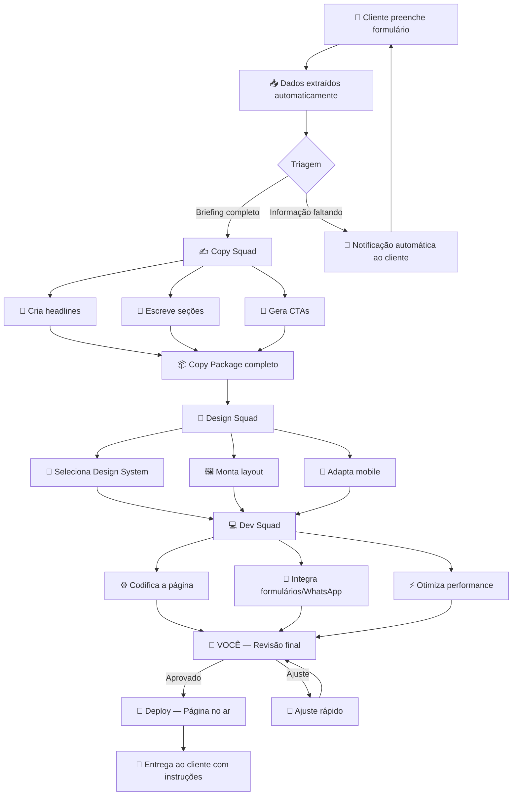

# 🏭 WebFactory — Site Profissional em 24h
### Ideia Inicial · Esboço Visual · Arquitetura AIOS

> **Status:** Ideia — 2026-02-23
> **Gerado por:** Muse (ideation-to-docs-squad)
> **Origem:** Transcrição de brainstorm

---

## 💡 A Ideia em Uma Frase

> Vender criação de sites e landing pages como serviço freelancer, entregando em **1–2 dias** a um preço que parece impossível — porque 90% do trabalho é feito por squads de IA.

---

## 🎯 O Modelo de Negócio

```
┌─────────────────────────────────────────────────────────────┐
│                    PROPOSTA DE VALOR                        │
│                                                             │
│   Mercado cobra:  R$ 5.000 – R$ 15.000  /  30–60 dias      │
│   Você entrega:   R$ 1.000 – R$ 2.500   /  1–2 dias        │
│                                                             │
│   → Mesma qualidade visual. Fração do preço. Velocidade 20x │
└─────────────────────────────────────────────────────────────┘
```

| Atributo | Mercado Tradicional | WebFactory |
|---|---|---|
| 💰 Preço | R$ 5k – 15k | R$ 1k – 2.5k |
| ⏱️ Prazo | 30 – 60 dias | **24 – 48h** |
| 🎨 Qualidade visual | Alta (designer) | Alta (Design System) |
| 🔄 Revisões | 2–3 rodadas / semanas | 1 rodada / horas |
| 📦 Entregável | Arquivo ou hospedagem | **No ar, publicado** |

**Onde vender:**
- Plataformas de freelancer (99Freelas, Workana, Upwork)
- Mercado local (cidade, região)
- Indicações / rede pessoal
- Redes sociais com cases reais

---

## 📋 O Formulário Inteligente

> O segredo está nas perguntas certas. Não deixar aberto demais — guiar o cliente para que as respostas gerem os inputs perfeitos para os squads.

### Estrutura do Formulário

```
┌──────────────────────────────────────────────────────┐
│  BLOCO 1 — Identidade da Empresa          (2 min)   │
├──────────────────────────────────────────────────────┤
│  BLOCO 2 — Estilo Visual                  (3 min)   │
├──────────────────────────────────────────────────────┤
│  BLOCO 3 — Objetivo da Página             (2 min)   │
├──────────────────────────────────────────────────────┤
│  BLOCO 4 — Público-Alvo                   (2 min)   │
├──────────────────────────────────────────────────────┤
│  BLOCO 5 — Conteúdo e Referências         (3 min)   │
└──────────────────────────────────────────────────────┘
                 Total: ~12 minutos
```

### Perguntas por Bloco

**Bloco 1 — Identidade**
| Pergunta | Tipo | Por quê |
|---|---|---|
| Nome da empresa/projeto | Texto curto | Identidade |
| Segmento de atuação | Múltipla escolha + outro | Contexto de nicho |
| Já tem logo? | Sim/Não + upload | Assets disponíveis |
| Já tem cores da marca? | Sim/Não + campo hex | Design system base |
| Descreva o que você faz em 2 frases | Texto curto | Brief de copy |

**Bloco 2 — Estilo Visual**
| Pergunta | Tipo | Por quê |
|---|---|---|
| Qual estilo mais combina? | Múltipla escolha com exemplos visuais | Direção do design |
| → Minimalista / Corporativo / Criativo / Bold / Elegante | | |
| Paleta de cores preferida | Grid de opções visuais | Tom visual |
| Referências de sites que você admira | Upload ou links | Inspiração concreta |

**Bloco 3 — Objetivo**
| Pergunta | Tipo | Por quê |
|---|---|---|
| Qual o objetivo principal da página? | Múltipla escolha | Define estrutura |
| → Capturar leads / Vender produto / Apresentar serviço / Portfólio | | |
| O cliente deve fazer o quê ao sair da página? | Múltipla escolha | CTA principal |
| → Ligar / WhatsApp / Preencher form / Comprar / Agendar | | |

**Bloco 4 — Público**
| Pergunta | Tipo | Por quê |
|---|---|---|
| Para quem é o seu produto/serviço? | Texto curto | ICP básico |
| Qual a maior dor/problema que você resolve? | Texto curto | Copy de dor |
| O que faz você melhor que a concorrência? | Texto curto | Diferencial |

**Bloco 5 — Conteúdo**
| Pergunta | Tipo | Por quê |
|---|---|---|
| Tem textos prontos ou eu crio do zero? | Sim/Não + upload | Copy existente |
| Tem fotos/imagens da empresa? | Upload opcional | Assets visuais |
| Quer depoimentos de clientes na página? | Sim + campo de texto | Prova social |
| Alguma observação adicional? | Texto livre | Detalhe livre |

---

## 🔄 O Pipeline Automatizado



---

## 🤖 Os Squads Necessários

```
┌─────────────────────────────────────────────────────────┐
│                    SQUAD 1: INTAKE                      │
│  Processa formulário → extrai briefing estruturado      │
│  Input: respostas do form + uploads                     │
│  Output: briefing.json (input padrão para os próximos)  │
└─────────────────────────────────────────────────────────┘
                          │
                          ▼
┌─────────────────────────────────────────────────────────┐
│                  SQUAD 2: COPY                          │
│  Cria todo o conteúdo textual da página                 │
│  Agentes: CopyChief → Copywriter especialista           │
│  Input: briefing.json                                   │
│  Output: copy-package.md (headline, seções, CTAs)       │
└─────────────────────────────────────────────────────────┘
                          │
                          ▼
┌─────────────────────────────────────────────────────────┐
│                 SQUAD 3: DESIGN + DEV                   │
│  Monta a página usando design system catalogado         │
│  Agentes: Designer → Dev → QA                           │
│  Input: copy-package.md + design-system escolhido       │
│  Output: página HTML/CSS pronta + mobile-first          │
└─────────────────────────────────────────────────────────┘
                          │
                          ▼
┌─────────────────────────────────────────────────────────┐
│                VOCÊ — QUALITY GATE                      │
│  Revisão humana final · Ajustes mínimos · Deploy        │
│  Tempo estimado: 30–60 min de atenção sua               │
└─────────────────────────────────────────────────────────┘
                          │
                          ▼
┌─────────────────────────────────────────────────────────┐
│              🚀 PÁGINA NO AR — CLIENTE FELIZ            │
└─────────────────────────────────────────────────────────┘
```

---

## 🎨 O Papel dos Design Systems

> Design Systems são o segredo da velocidade e qualidade. Em vez de criar do zero, os squads plugam o conteúdo em templates já testados e validados.

```
Design Systems Catalogados
         │
    ┌────┴────┐
    │         │
    ▼         ▼
Estilo A   Estilo B   Estilo C   ...
(Minimalista) (Bold)  (Elegante)
    │
    ▼
Cliente escolhe no formulário
    │
    ▼
Squad seleciona o DS correspondente
    │
    ▼
Copy é injetada no DS
    │
    ▼
Página pronta com consistência visual garantida
```

**Como catalogar os Design Systems:**
- Cada DS tem: paleta de cores, tipografia, componentes, layouts de seção
- Armazenados como templates no squad
- Novos DS adicionados ao catálogo a cada projeto entregue
- Com o tempo: biblioteca de 10–20 DS prontos para qualquer nicho

---

## ⚙️ Arquitetura no AIOS

```
WebFactory Squad
├── agents/
│   ├── briefing-extractor.md    ← processa o formulário
│   ├── copy-chief.md            ← orquestra a copy
│   ├── web-designer.md          ← seleciona DS + layout
│   ├── web-dev.md               ← codifica a página
│   └── qa-reviewer.md           ← valida antes de entregar
│
├── tasks/
│   ├── extract-briefing.md      ← form → briefing.json
│   ├── generate-copy.md         ← briefing → copy-package
│   ├── select-design-system.md  ← estilo → DS correto
│   ├── build-page.md            ← copy + DS → HTML/CSS
│   ├── qa-check.md              ← validação de qualidade
│   └── deploy-page.md           ← publicar no ar
│
├── templates/
│   ├── briefing-tmpl.json       ← estrutura do briefing
│   ├── copy-package-tmpl.md     ← estrutura da copy
│   └── design-systems/          ← catálogo de DS
│       ├── ds-minimalista/
│       ├── ds-bold/
│       └── ds-elegante/
│
└── workflows/
    └── webfactory-pipeline.yaml ← orquestra tudo
```

---

## 📊 A Matemática do Negócio

```
Por projeto:
┌──────────────────────────────────────────────────┐
│  Receita:        R$ 1.500  (ticket médio)        │
│  Custo de API:   R$  30–80 (tokens dos squads)   │
│  Seu tempo:      1–2h (revisão + deploy)          │
│  Margem:         ~95%                             │
└──────────────────────────────────────────────────┘

Por mês (meta conservadora):
┌──────────────────────────────────────────────────┐
│  10 projetos × R$ 1.500 = R$ 15.000/mês         │
│  Custo total API: ~R$ 600                        │
│  Lucro líquido: ~R$ 14.400/mês                  │
│  Seu tempo total: ~15–20h/mês                   │
└──────────────────────────────────────────────────┘
```

---

## 🔮 Questões em Aberto

Estas questões precisam ser respondidas antes de construir o squad:

- [ ] **Qual tecnologia de formulário?** (Typeform, Google Forms, formulário próprio, Tally)
- [ ] **Onde hospedar as páginas entregues?** (Vercel, Netlify, cPanel do cliente)
- [ ] **Como fazer o pagamento antes da entrega?** (PIX, plataforma freelancer)
- [ ] **Qual o stack das páginas?** (HTML/CSS/JS puro, Next.js, WordPress, Webflow)
- [ ] **Quais os primeiros Design Systems a catalogar?** (3–5 para começar)
- [ ] **Como escalar?** (Criar pacotes: Básico / Pro / Premium)

---

## 🚀 Próximos Passos (Quando for executar)

```
1. Definir o stack técnico (formulário + hospedagem + tecnologia da página)
2. Criar o formulário de briefing inteligente
3. Catalogar os primeiros 3 Design Systems
4. Criar o squad WebFactory no AIOS (@squad-creator)
5. Testar com 1 projeto real (pode ser pro bono para validar)
6. Ajustar pipeline com base no resultado
7. Publicar o serviço e vender
```

---

> *Documento gerado por Muse (ideation-to-docs-squad) — Synkra AIOS*
> *Sessão: webfactory-ideation-2026-02-23*
