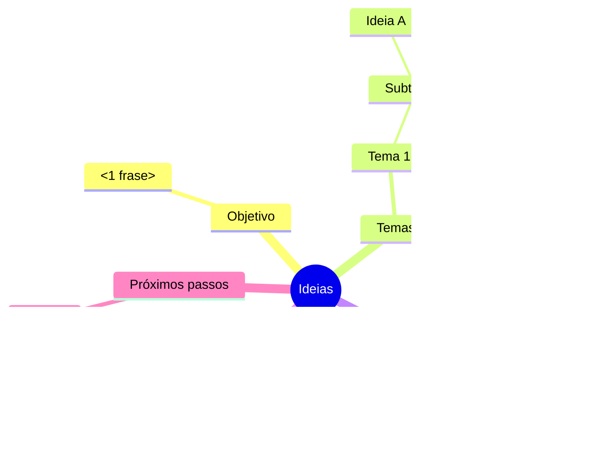

# Mindmap (Mermaid)

> Gerado a partir de `ideation.json`.

```mermaid
mindmap
  root((Ideias))
    Objetivo
      <1 frase>
    Temas
      Tema 1
        Subtema 1
          Ideia A
          Ideia B
      Tema 2
    Decisões
      Decisão 1
    Perguntas em aberto
      Pergunta 1
    Próximos passos
      Ação 1
```

